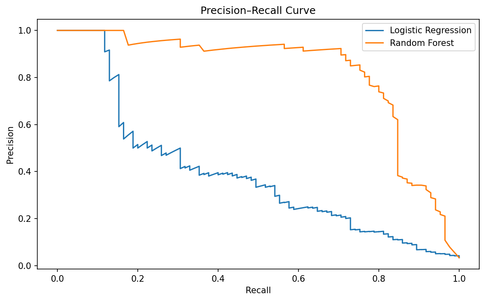
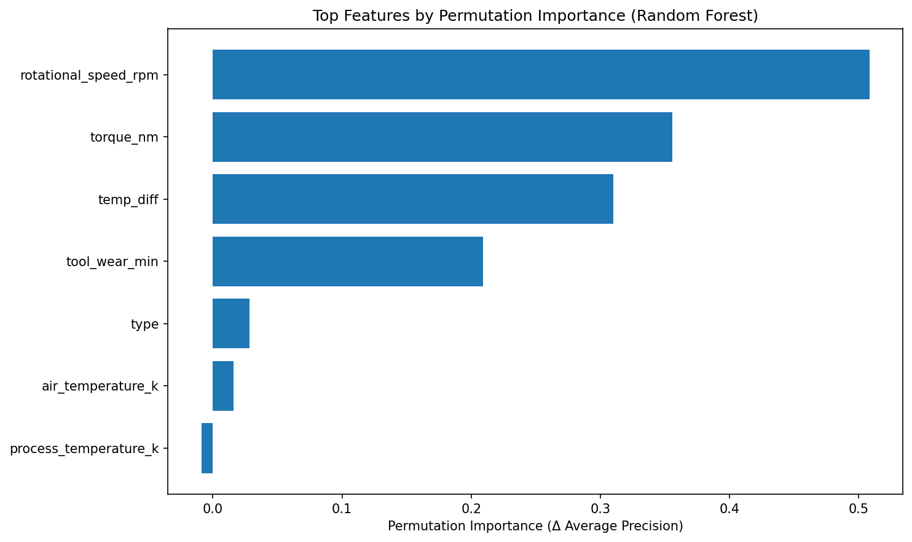

# Manufacturing Downtime Analysis

## Executive summary

This project analyzes manufacturing sensor and operational data to identify the primary drivers of machine downtime and to build a predictive model that estimates failure risk. The goal is early warning: prioritizing detection of rare failures over optimizing raw accuracy.

**Key results**

* **Random Forest** achieved **ROC AUC 0.969** and **Average Precision 0.819**, with tuned **Recall 0.86** and **Precision 0.38**
* **Logistic Regression** baseline achieved **ROC AUC 0.882** and **Average Precision 0.39**, with tuned **Recall 0.86** and **Precision 0.11**

These results demonstrate that nonlinear models significantly improve ranking performance for rare failure events while maintaining high recall.

---

## Business context

Unplanned machine downtime is expensive and disruptive. In real manufacturing environments, missing an impending failure is often far more costly than triggering a false alarm.

This project explicitly addresses common operational constraints:

* Severe class imbalance
* Recall-first decision making
* Decision threshold tuning under operational tradeoffs
* Model interpretability to support maintenance decisions

The objective is not just prediction, but actionable insight into which operating conditions most strongly signal failure risk.

---

## Data

The dataset follows a predictive maintenance structure and includes:

* Machine operating parameters
* Sensor measurements during operation
* Accumulated wear indicators
* Labeled failure events

Both static attributes and dynamic operational signals are present, enabling comparison of their relative predictive value.

---

## Methodology

Two models were evaluated:

* **Logistic Regression** as a transparent baseline
* **Random Forest** to capture nonlinear relationships and feature interactions

Model performance was assessed using **ROC AUC** and **Average Precision**, which are more appropriate than accuracy under class imbalance. Decision thresholds were tuned to prioritize **recall**, reflecting real-world maintenance costs where missed failures are significantly more expensive than false alarms.

---

## Results

| Model               | ROC AUC | Avg Precision | Recall (tuned) | Precision (tuned) |
| ------------------- | ------: | ------------: | -------------: | ----------------: |
| Logistic Regression |   0.882 |          0.39 |           0.86 |              0.11 |
| Random Forest       |   0.969 |         0.819 |           0.86 |              0.38 |

**Business takeaway**
At a fixed recall target of approximately 0.86, the random forest achieves substantially higher precision than logistic regression, resulting in far fewer false positives while maintaining strong failure detection. This makes it more practical for preventive maintenance scenarios.

---

## Model performance

The precision–recall curve below illustrates the recall–precision tradeoff under severe class imbalance and highlights the superior ranking performance of the random forest model.



---

## Feature importance (interpretability)

Permutation feature importance highlights the operational stress signals most associated with failure risk:

* Rotational speed
* Torque
* Temperature differential
* Accumulated tool wear

Static product attributes contribute minimally once operating conditions are included, suggesting that **how a machine is used matters more than which product it is producing**.



A ranked summary of feature importances is exported to:
`reports/data/random_forest_permutation_importance.csv`

---

## Tech stack

* Python 3.11
* pandas, numpy
* scikit-learn
* matplotlib
* Jupyter Notebook

---

## Reproducibility

All results in this repository can be reproduced by running the notebooks in numerical order.

1. Create and activate a virtual environment:

   ```bash
   python -m venv .venv
   source .venv/bin/activate
   ```

2. Install dependencies:

   ```bash
   pip install -r requirements.txt
   ```

3. Launch notebooks:

   ```bash
   jupyter nbclassic
   ```

   or

   ```bash
   jupyter notebook
   ```

Run notebooks in the following order:

1. `notebooks/01_data_overview_quality_check.ipynb`
2. `notebooks/02_baseline_failure_model.ipynb`
3. `notebooks/03_model_comparison_threshold_tuning.ipynb`

---

## Project structure

```
manufacturing-downtime-analysis/
│
├── data/
│   ├── raw/
│   └── processed/
│
├── notebooks/
│   ├── 01_data_overview_quality_check.ipynb
│   ├── 02_baseline_failure_model.ipynb
│   └── 03_model_comparison_threshold_tuning.ipynb
│
├── outputs/
│   └── legacy_intermediate_files/
│
├── reports/
│   ├── figures/
│   │   ├── rf_permutation_importance.png
│   │   └── rf_precision_recall_curve.png
│   └── data/
│       └── random_forest_permutation_importance.csv
│
├── src/
├── requirements.txt
├── README.md
└── .gitignore
```

---

## Key takeaways

* Failure risk is driven primarily by operational stress rather than static product attributes
* Threshold tuning is essential when failure events are rare and recall is prioritized
* Explainable modeling improves trust and actionability for maintenance teams
* Monitoring real-time operating conditions enables earlier intervention and reduced unplanned downtime

---

## Limitations

* The analysis assumes future operating conditions resemble the training data
* Metrics are optimized statistically rather than via explicit cost functions
* Feature importance reflects associations, not causal relationships

---

## Future work

* Incorporate cost-sensitive learning or explicit cost curves
* Evaluate near-real-time performance with streaming sensor data
* Explore temporal models to capture degradation trends
* Integrate predictions into scheduling and maintenance workflows

---

## Data source

This project uses the **AI4I 2020 Predictive Maintenance Dataset**, a publicly available dataset released for research and educational use.

Source: https://archive.ics.uci.edu/ml/datasets/AI4I+2020+Predictive+Maintenance+Dataset

The dataset is used solely for non-commercial, educational, and portfolio purposes. No proprietary or sensitive data is included.